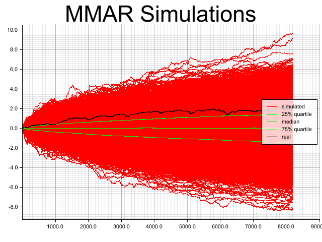

# multifractal-asset-model
A multifractal model of asset returns, inspired by the 1997 paper by Mandelbrot, Fisher, Calvet and Mandelbrot's book "The Misbehavior of Markets".

I have found this model very challenging to understand and implement from the texts available, hopefully this code helps others that are similarily inclined.

Code was written with https://github.com/Deckstar/Multifractal-Model-of-Asset-Returns-MMAR-for-Thesis as a closely studied reference to keep parity with output. 

I believe that there are some subtle errors in the code at the moment. The magnitude of the real data does not match the simulated data, which is likely an error in my use of the stochastic library. The fBM model also seems to be overly centered around zero despite H > 0.50. 
